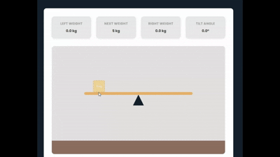
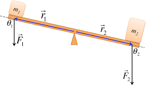

<div align="center">
  


</div>

<h3 align="center" 
style="color:#ffffff; font-size:25px; font-family: 'Poppins', sans-serif;">
⚖️ Seesaw Simulation ⚖️
</h3>

<hr style="width:80%; border:1px solid #ffffff; opacity:0.4;">

<p align="center" style="color:#ffffff; font-size:16px;">
    A interactive <b>Seesaw Simulation</b> built with HTML, CSS and pure JavaScript.<br>
    Users can drop boxes of different weights onto the seesaw to observe how torque and balance affect the tilt angle in real time.The simulation also includes live weight tracking, tilt angle display, an event log and state persistence using Local Storage.
</p>

<hr style="width:100%; border:1px solid #ffffff; opacity:0.4;">

<h4 style="color:#ffffff; font-size:20px; font-family: 'Poppins', sans-serif;">
🧩 Thought Process & Design Decisions
</h4>

<p style="color:#ffffff; font-size:16px;">
    The main goal of this project was to create an interactive interface where users can intuitively observe torque balance on a seesaw. I focused on replicating a simple real-world seesaw system in a clear and visually understandable digital format.
</p>

<p style="color:#ffffff; font-size:16px;">
    My thought process included the following principles:
</p>

<ul style="color:#ffffff; font-size:16px;">
  <li><b>Used a simplified physics model:</b> <br>
  I used the basic torque formula (torque = weight × distance) to keep the user experience smooth and avoid unnecessary complexity. I kept the tilt angle directly proportional to the net torque for simplicity.</li>
  <li><b>Implemented a modular architecture:</b> <br>
 I separated the JavaScript files into physicsManager, objectManager, and storageManager to improve code readability.</li>
</ul>

<br>

<h4 style="color:#ffffff; font-size:20px; font-family: 'Poppins', sans-serif;">
🔍 Trade-offs & Limitations
</h4>

<ul style="color:#ffffff; font-size:16px;">
  <li><b>Pixel-based distance measurement:</b> <br>
  Distances are calculated in pixels rather than physical units, so accuracy depends on the visual scale.</li>
  <li><b>Simplified drop physics:</b> <br/>
  Boxes fall according to the click angle instead of dropping straight down. Since the fall path depends on where the user clicks on the seesaw, the object trajectory can look slightly unrealistic compared to real vertical free fall.</li>
</ul>

<br>

<h4 style="color:#ffffff; font-size:20px; font-family: 'Poppins', sans-serif;">
AI Assistance
</h4>

<ul style="color:#ffffff; font-size:16px;">
  <li>I used AI assistance to refine the clarity, flow, and organization of the README text.</li>
  <li>I also used it to make minor syntax corrections and ensure clean, consistent JavaScript code.</li>
  <li>Additionally, AI helped me identify and fix small bugs during the development process.</li>
</ul>

<h4 style="color:#ffffff; font-size:20px; font-family: 'Poppins', sans-serif;">
🎬 Demo
</h4>

<p style="color:#ffffff; font-size:16px;">
    The following demo shows how users can interact with the seesaw by dropping boxes of different weights and observing real-time balance changes.
</p>

<div align="center">

 </div>

<br>

<p align="center">
  <a href="https://iremnuromgen.github.io/seesaw-simulation-iremnur-omgen/" target="_blank">
    🔗 <b>Live Demo</b> — Try it here!
  </a>
</p>


<h4 style="color:#ffffff; font-size:20px; font-family: 'Poppins', sans-serif;">
🧠 Tech Stack
</h4>

<ul style="color:#ffffff; font-size:16px;">
  <li><b>HTML5 :</b> Semantic and accessible structure</li>
  <li><b>CSS3 :</b> Responsive layout and animations</li>
  <li><b>Vanilla JavaScript (ES6 Modules) :</b> Physics, state, and event handling</li>
  <li><b>LocalStorage API :</b> State persistence after page refresh</li>
</ul>

<br>

<h4 style="color:#ffffff; font-size:20px; font-family: 'Poppins', sans-serif;">
💡 Features
</h4>

<ul style="color:#ffffff; font-size:16px;">
  <li>🎯<b>Real-time physics</b> - calculates torque based on distance × weight</li>
  <li>🧱<b>Interactive object placement</b> - hover preview & click to drop</li>
  <li>🔄<b>Persistent state</b> - localStorage keeps boxes, tilt, and logs</li>
  <li>🧾<b>Event log system</b> - shows detailed placement history</li>
  <li>⚡<b>Smooth animations</b> - falling effect & responsive tilt transitions</li>
</ul>

<br>

<h4 style="color:#ffffff; font-size:20px; font-family: 'Poppins', sans-serif;">
⚙️ Torque Calculation Logic
</h4>

<div align="center">

 </div>

<p style="color:#ffffff; font-size:16px;">
    In the image above, two masses (<b>m₁</b> and <b>m₂</b>) are placed on opposite sides of a seesaw.  
    Each mass exerts a downward force due to gravity (<b>F₁</b> and <b>F₂</b>) at different distances (<b>r₁</b> and <b>r₂</b>) from the pivot point.
</p>


<p style="color:#ffffff; font-size:16px;">
    The <b>torque</b> applied by each side is calculated using the formula:
</p>

<p align="center" style="color:#ffffff; font-size: 30px; font-weight: bold;">
∑ T = (M₁r₁) × (M₂r₂)
</p>

<p style="color:#ffffff; font-size:16px;">
    Where:
</p>

<ul style="color:#ffffff; font-size:16px;">
  <li><b>M₁, M₂</b> → Box weights (in kilograms)</li>
  <li><b>r₁, r₂</b> → Horizontal distances from the center pivot (in pixels)</li>
  <li><b>∑T</b> → Net torque, determining the tilt direction</li>
  <li><b>θ</b> → Tilt angle, proportional to the net torque (<code>θ = ∑T / 100</code>)</li>
</ul>

<p style="color:#ffffff; font-size:16px;">
    If the net torque is zero, the seesaw remains perfectly balanced.  
    A positive torque tilts the plank to the right, and a negative torque tilts it to the left.
</p>

<br>

<h4 style="color:#ffffff; font-size:20px; font-family: 'Poppins', sans-serif;">
💻 Installation & Usage
</h4>

<p style="color:#ffffff; font-size:16px;">
  Follow the steps below to clone and run the project locally.
</p>

```bash
# Clone the repository
git clone https://github.com/iremnur-omgen/seesaw-simulation-iremnur-omgen.git
cd seesaw-simulation-iremnur-omgen

# Open the project in your browser
start index.html
```


<h4 style="color:#ffffff; font-size:20px; font-family: 'Poppins', sans-serif;">
🗂️ Project Structure
</h4>

```
📁 seesaw-simulation-iremnur-omgen/
├── index.html                  # Main entry point
├── src/
│   ├── css/
│   │   └── style.css           # Styles and animations
│   └── js/
│       ├── main.js             # Core app logic & event handling
│       ├── objectManager.js    # Manages creation and rendering of boxes
│       ├── physicsManager.js   # Calculates torque and balance logic
│       └── storageManager.js   # Handles localStorage persistence
└── assets/
    ├── seesaw-simulation.gif
    └── torque.png
```
<h4 style="color:#ffffff; font-size:20px; font-family: 'Poppins', sans-serif;">
🪪 License
</h4>

<p style="color:#ffffff; font-size:16px;">
  <b>Author : </b> İremnur Ömgen
</p>